  

# Jonathan Zacarias

Computer Science student at Universidad del Valle de Guatemala (UVG). I build software engineering, systems, networking, and data/AI projects through academic and personal work. Currently exploring cybersecurity.

---

## Focus

* Software engineering: team projects, Git, code review, testing, and documentation
* Systems and parallel computing: C, POSIX threads, sockets, and OpenMP
* Computer networks: protocol implementation, network communication, and traffic analysis with Wireshark
* Data and AI: PyTorch, scikit-learn, pandas, and PySpark
* Web development: React, Vite, Node.js, Express, and PostgreSQL
* Cybersecurity: currently exploring security concepts, networking, and related technologies

---

## Tech Stack

**Languages:** C, C++, Java, Python, JavaScript, TypeScript, Kotlin, SQL

**Systems and networking:** OpenMP, POSIX threads, sockets, JSON-RPC, WebSockets, Wireshark, Make

**Data and AI:** PyTorch, scikit-learn, pandas, PySpark (MLlib), Jupyter

**Web:** React, Vite, Node.js, Express, PostgreSQL

**Tools:** Git, Docker

---

## Featured Projects

### [ProyectoDeepLearning](https://github.com/Zacatac23/ProyectoDeepLearning)

Fraud detection project using synthetic transaction data. Compares a tabular MLP, an LSTM, and a hybrid dual-branch neural network using PyTorch. Includes cost-based threshold selection and a permutation test for model evaluation.

`Python` `PyTorch` `Jupyter`

---

### [Proyecto1Paralela](https://github.com/Zacatac23/Proyecto1Paralela)

SDL2 particle-based screensaver used to study parallel performance with OpenMP. Includes a sequential baseline, benchmark scripts, speedup analysis, and an Amdahl's Law ceiling analysis.

`C` `OpenMP` `SDL2` `Make`

---

### [chat-bot-redes](https://github.com/Zacatac23/chat-bot-redes)

Network programming project implementing an MCP host with a from-scratch JSON-RPC 2.0 implementation over stdio and HTTP. Includes a WebSocket-based web inspector and Wireshark analysis of TLS traffic.

`TypeScript` `Node.js` `Express` `Docker`

---

### [Proyecto-chat-sistos](https://github.com/Zacatac23/Proyecto-chat-sistos)

Multithreaded chat server and client implemented in C using sockets. Uses a fixed-size binary packet protocol and mutex-protected shared state to coordinate concurrent clients.

`C` `POSIX threads` `Sockets`

---

### [Proyecto2_Mineria](https://github.com/Zacatac23/Proyecto2_Mineria)

Machine learning project using Guatemalan mortality data from INE. Compares decision tree, random forest, and logistic regression models using a reproducible training workflow.

`Python` `scikit-learn` `pandas`

---

### [Freelance Hub - Frontend](https://github.com/G1LB3T0/Proyecto_Freelance_FrontEnd)

Full-stack team project for a platform connecting freelancers and clients. My contributions include frontend pages, styling, settings, internationalization, and statistics views.

The project uses React and Vite on the frontend and Node.js, Express, Prisma, and PostgreSQL on the backend. I also contributed to the backend settings endpoints.

* [Frontend Repository](https://github.com/G1LB3T0/Proyecto_Freelance_FrontEnd)
* [Backend Repository](https://github.com/G1LB3T0/Proyecto_Freelance_BackEnd)

`React` `Vite` `JavaScript` `Node.js` `Express` `Prisma` `PostgreSQL`

---

## Contribution Activity

  <picture>
    <source media="(prefers-color-scheme: dark)" srcset="https://raw.githubusercontent.com/Zacatac23/Zacatac23/output/github-snake-dark.svg" />
    <source media="(prefers-color-scheme: light)" srcset="https://raw.githubusercontent.com/Zacatac23/Zacatac23/output/github-snake.svg" />
    
  </picture>

---

## Contact

* LinkedIn: [COMPLETAR: URL de LinkedIn]
* Email: [COMPLETAR: correo]
